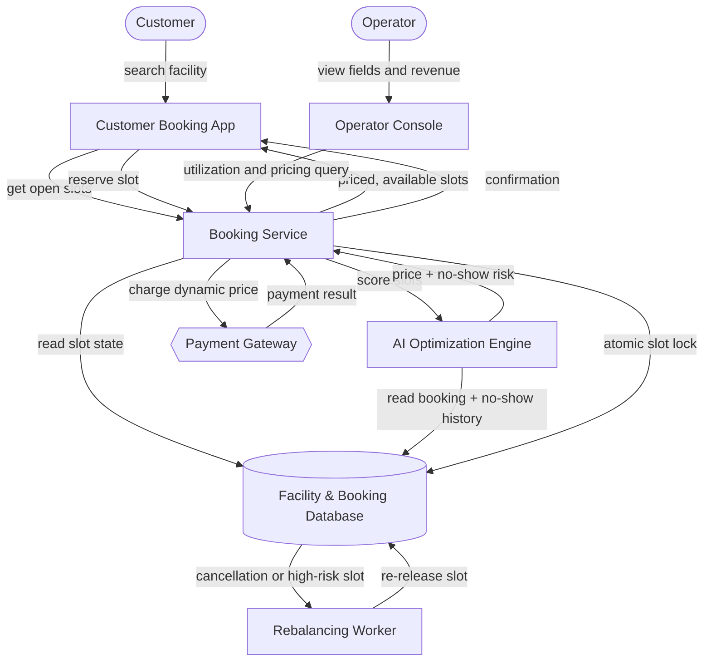

# Architecture: AI-Powered Soccer Facility Booking & Utilization Platform

## The Idea

> An AI-powered soccer facility management platform built for facility owners/operators. It uses AI to optimize field/turf scheduling and utilization — predicting no-shows, dynamically pricing slots, and rebalancing bookings in real time — so operators maximize revenue and minimize idle field time across their pitches. The one thing it must do well on day one: frictionless booking, meaning any operator or customer can find and reserve an open slot in seconds with zero double-bookings.

## Components

| Component | What it does for this project | Words that required it |
|---|---|---|
| **Customer Booking App** | Lets a customer search a facility's fields and reserve an open slot in seconds. | "customer", "find and reserve an open slot" |
| **Operator Console** | Lets a facility owner/operator see field utilization, revenue, and pricing, and manage their fields. | "facility owners/operators", "maximize revenue and minimize idle field time" |
| **Booking Service** | Owns the reservation logic and locks a slot atomically the instant it's chosen, which is the component that guarantees zero double-bookings on day one. | "reserve an open slot ... with zero double-bookings" |
| **Facility & Booking Database** | Stores fields, slots, reservations, and booking/no-show history so state outlives any single session. | "field/turf scheduling", "booking" |
| **AI Optimization Engine** | Scores each open slot with a no-show probability and a recommended dynamic price, using historical booking data. | "predicting no-shows", "dynamically pricing slots" |
| **Rebalancing Worker** | Reacts in the background to cancellations and high no-show-risk slots by re-releasing them for booking immediately. | "rebalancing bookings in real time" |
| **Payment Gateway** *(third party)* | Charges the customer the dynamically computed price at the moment of reservation. | "dynamically pricing slots" (a price only means something if it's collected) |

Every node traces to a specific phrase above. Nothing else in the paragraph implies a component that isn't already listed — no messaging system, no league/tournament manager, no mobile-native app, no multi-tenant franchise layer, because the idea never says any of that.

## How It Fits Together

**Read this diagram, one line each:**
- Customer books through the Customer Booking App, never touching the database directly.
- The Booking Service is the single place slots get locked — that's what makes zero-double-booking possible.
- The AI Optimization Engine only ever reads history and returns a score; it never writes a reservation itself.
- The Rebalancing Worker is the only component that runs without a human waiting on it.

## Data Flow

1. Customer opens the **Customer Booking App** and searches for available slots at a facility.
2. The app asks the **Booking Service** for open slots.
3. The Booking Service reads current slot state from the **Facility & Booking Database**.
4. The Booking Service asks the **AI Optimization Engine** to score each open slot.
5. The AI Optimization Engine reads historical booking and no-show data from the database and returns a recommended price and no-show-risk score per slot.
6. The Booking Service returns priced, available slots to the Customer Booking App.
7. The customer picks a slot; the Booking Service **atomically locks that slot** in the database and creates a pending reservation — this is the step that guarantees zero double-bookings.
8. The Booking Service charges the dynamically computed price through the **Payment Gateway**.
9. On payment success, the Booking Service confirms the reservation in the database and returns confirmation to the Customer Booking App.
10. Separately, an **Operator** opens the **Operator Console** to view utilization, revenue, and current pricing, which the console pulls from the Booking Service.
11. When a booking is cancelled, or the AI Optimization Engine flags a slot as high no-show risk, the database change triggers the **Rebalancing Worker**.
12. The Rebalancing Worker re-releases the slot immediately so it becomes bookable again, closing the loop back to step 2.

## Build Order

| Phase | Builds | Proves |
|---|---|---|
| 1. Core Booking | Booking Service + Facility & Booking Database + Customer Booking App, with atomic slot locking | A customer can find and reserve a slot in seconds with zero double-bookings — the day-one requirement, before any AI exists |
| 2. Operator Console | Read-only utilization and revenue views on top of the Phase 1 data | Operators can see what's happening on their fields in real time |
| 3. Payments | Payment Gateway wired into the reservation step | A real charge completes end-to-end against a real (even if static) price |
| 4. AI Optimization Engine | No-show prediction and dynamic pricing, trained on the booking history Phase 1–3 have been accumulating | The AI's price and risk scores actually change behavior — more revenue or less idle time than static pricing |
| 5. Rebalancing Worker | Background worker reacting to cancellations and high-risk slots | Slots freed by a no-show or cancellation get rebooked in real time instead of sitting idle |

Phase 1 is the make-or-break phase: it alone delivers the sentence the idea says must work on day one, and every later phase only makes the same reservation smarter or more automatic — none of them are required for booking to work correctly.

## Assumptions

| Assumption | Impact if wrong |
|---|---|
| Each operator manages their own independent set of fields (no shared multi-operator facilities) | If facilities are shared across operators, the database and Operator Console need an ownership/permissions model, not just a facility ID |
| Dynamic pricing implies the platform also collects payment, so a Payment Gateway is in scope | If operators actually settle payment offline (cash/POS at the facility), the Payment Gateway and its failure-handling drop out entirely, simplifying Phase 3 away |
| "Real time" rebalancing means a reactive worker that runs within seconds to minutes of a trigger, not hard real-time (sub-second) guarantees | If true real-time is required, the Rebalancing Worker needs a stream-processing design instead of a simple background job |
| The AI Optimization Engine can start as a statistical model trained on the platform's own accumulating booking/no-show history, not a pre-trained third-party model | If no historical data exists yet, Phase 4 needs a cold-start plan (e.g., rule-based pricing) until enough bookings accumulate to train on |

## What This Design Does Not Cover

- Multi-facility franchise or brand-level management (the idea describes a single operator's fields, not a chain).
- League, tournament, or team-management features — nothing in the idea mentions leagues or teams.
- Notifications (email/SMS confirmations or reminders) — plausible in a real product, but the idea never states it, so it's left out rather than assumed.
- Native mobile apps — the idea doesn't specify a platform, so this design assumes a responsive web app is sufficient for day one.
- Detailed authentication/authorization design beyond "operator" and "customer" as the two roles the idea names.
- Any pricing floor/ceiling business rules for the AI — the idea says pricing is dynamic but not by how much; that's a product decision, not an architecture one.
